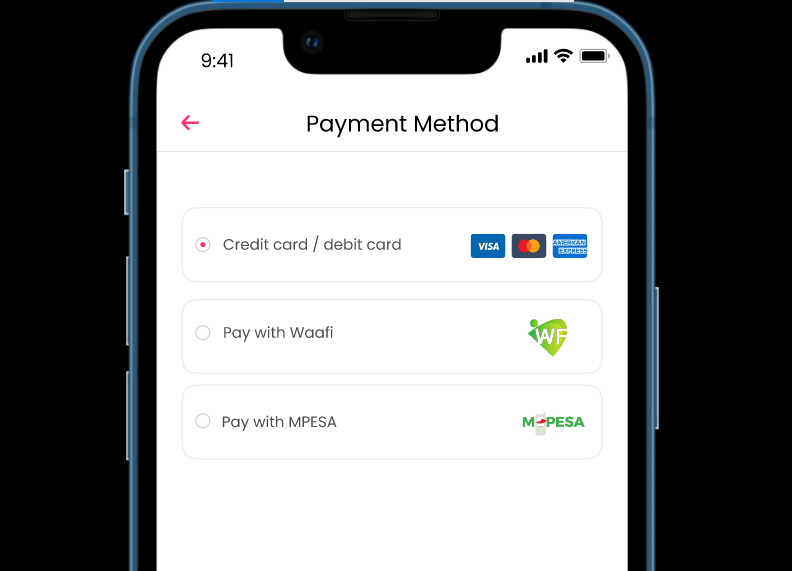

# Payment methods

We have two payment option:
1. Credit/debit card payment
2. Mobile Money payment

**For card payments:** On Android devices, users will be redirected to the Google payment system, while on iOS devices, payments will be processed through Apple's payment 

**Mobile Money payment:** This payment option is specific to Somalia and is facilitated by local telecommunications providers. They offer a payment gateway service that enables businesses to receive payments online. I will provide the necessary API integration to connect and utilize this payment method within the app

