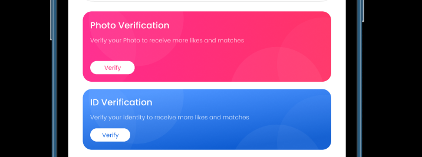
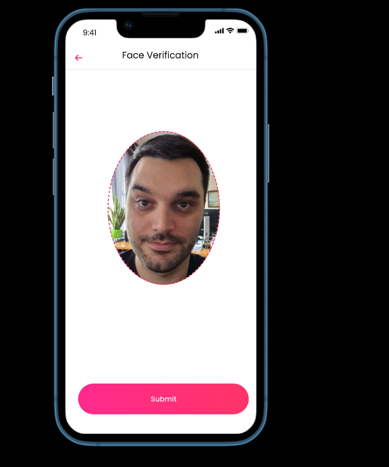

# User verification ☑️

## How verification works.

In Gayaan, users can choose to verify their account through two methods:

1. ID Verification:

     1. Users upload their identification documents.
     2. The submitted documents trigger a notification in the web admin.
     3. Admin personnel review and verify the ID.
     4. Upon approval, the user's profile receives a blue verification badge.
     5. Close Selfie Photo Verification:

1. Users capture a close-up selfie of their face.
    1. They submit this selfie to the platform.
    2. The submitted selfie generates a verification request.
    3. Admin cross-reference the submitted selfie with other pictures.
    4. If the cross-check is successful, the selfie is approved, and user's profile receives a blue verification badge.
    
    
    

     

     Face verification
     

    