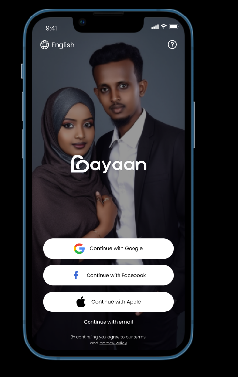
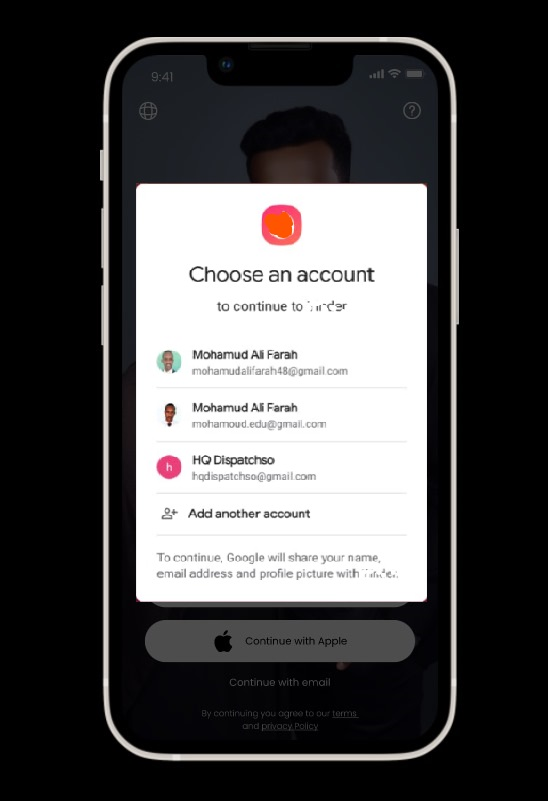
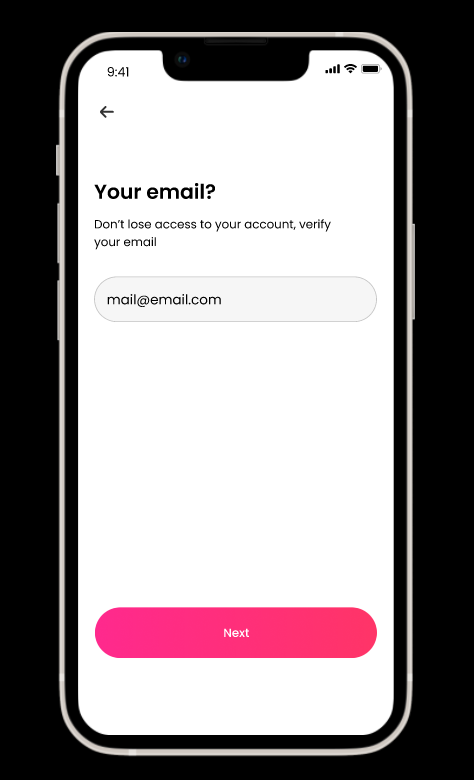
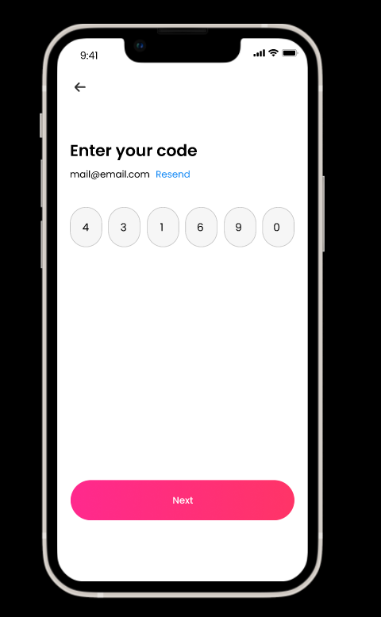
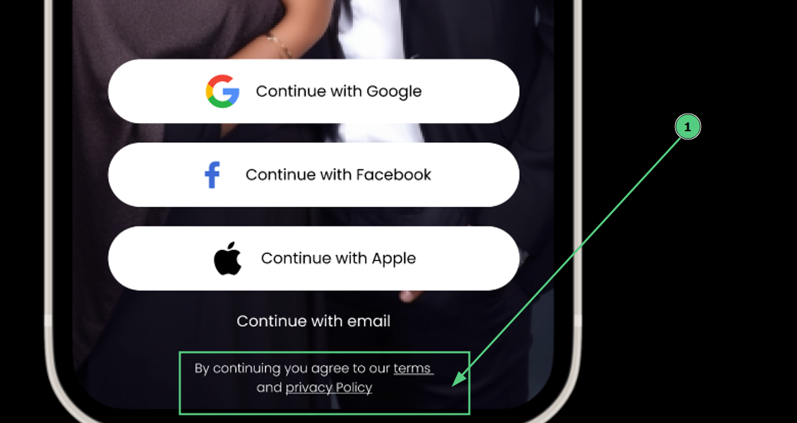
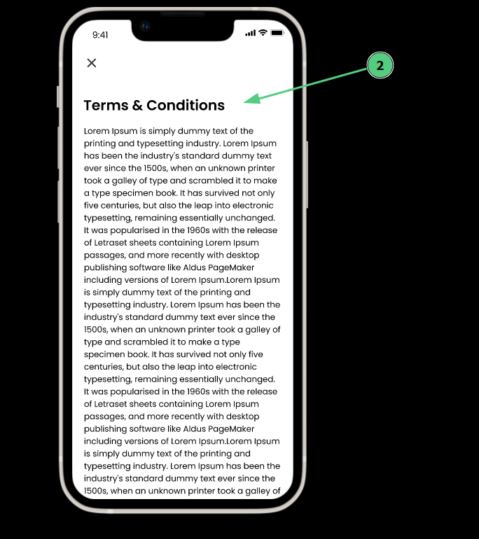

# Authentication

## Signup Options

We have two option of singing up:

<b>Option 1:</b> Authentication through social media accounts inculding apple accounts

  1. Singup with `Google`
  2. Signup with `Facebook`
  3. Signup with `Apple`

  

:::note

  The social account authentication process should occur within the app itself. For instance, when you choose to sign up with Google, a popup screen will appear where you can select your email, complete the authentication, and then proceed to the next screen:

  In addtion to that, we don't source data such as Names, profile photos from social login, we will be using only for the purpose of authentication. 

:::

<b>Option 2:</b> Signup with email address.

  Upon selecting `Continue with email`, a screen for entering email address will open. After entering the email and clicking "Continue," the system will send a verification code to the email. It will then be directed to a new screen where you can enter the verification code. After successful verification, user can set up a password and proceed to the next screen for the profile info.

## Logout & Device recognition
When a user logs out, the app should store device information to recognize the user's device. Instead of displaying a `Signup` screen, it should show `Login` with button `Continue as UserName`

  
Log out and then log in

  

:::tip

#### Device Identification:

**Android:** 
You can use the Android ID, which is a unique identifier for the user's device.

**iOS:** 
On iOS, you can use the Identifier for Vendor (IDFV) or Identifier for Advertising (IDFA). 
:::

## Terms and policy agreement

  

  Below the social login, there is a terms and policy agreement
  

  

  

  

:::note
  
Currently, the content for the terms and policy is not ready, so for the time being, use this below sample.
  

:::

====== Begin =========

**Gayaan - Terms and Policy Agreement**

Welcome to Gayaan, a platform designed to connect Somali Muslims seeking life partners for marriage. By using our app, you agree to the following terms and policies:

**Community Guidelines:** Respect all users and maintain a respectful, inclusive environment. Discrimination or harassment will not be tolerated.

**Privacy:** Protect user privacy at all times. Do not share personal information without consent.

**Sincerity:** Use Gayaan with genuine intentions for marriage, not for casual or inappropriate interactions.

**Safety:** Report any suspicious or harmful behavior to our support team immediately.

**Age:** Users must be of legal age for marriage in their respective regions.

**User Content:** Do not post offensive, explicit, or copyrighted content. We reserve the right to remove such content.

**Account Termination:** We may suspend or terminate accounts violating our terms without notice.

**Dispute Resolution:** Any disputes shall be resolved through arbitration.

**Updates:** These terms are subject to change; users will be notified of updates.

**Legal Compliance:** Users must adhere to applicable laws while using Gayaan.

By using Gayaan, you agree to these terms and policies. Failure to comply may result in account suspension or termination. Thank you for being a part of our community.

==== END ====

