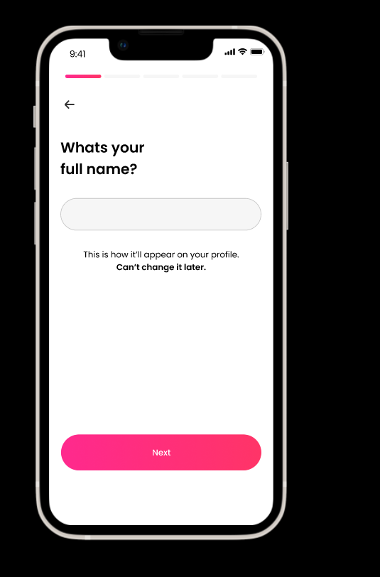
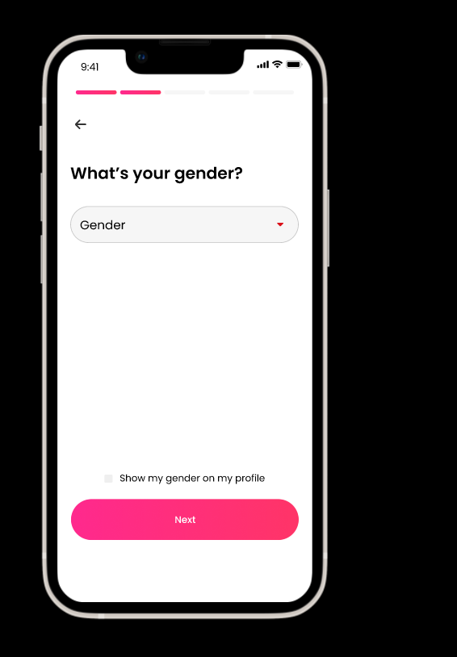
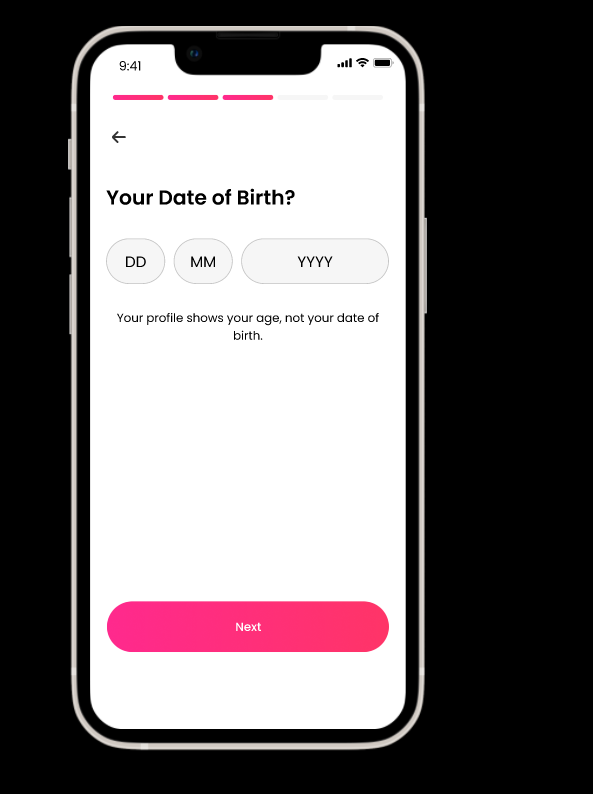
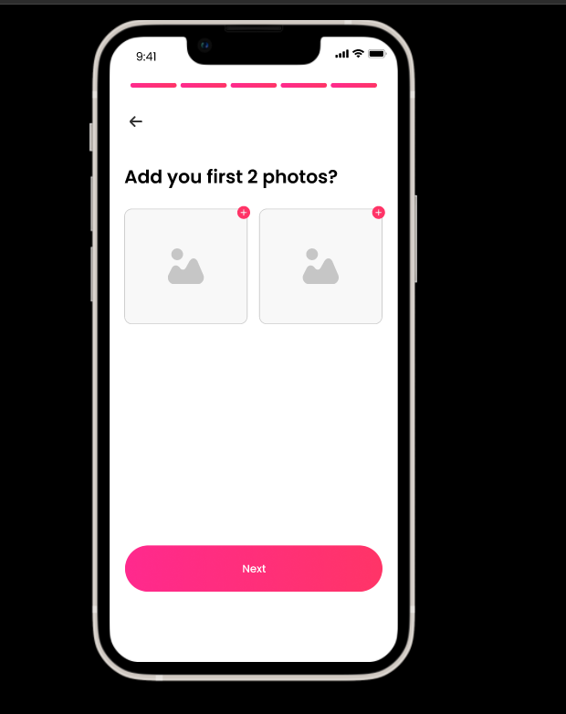

# Signup profile info

**List of signup profile informaton to be filled**
1.	Full Name
2.	Gender
3.	Date of Birth
4.	Marital Status
5.	Education
6.	Profession
7.	Brief Bio
8.	Photo

## User profile madatory information

After the singup, the process of filling signup user profiles starts as follows;

  
<b>Step 1: </b>Whats your full name?

  

  
<b>Step 2: </b>What's you gender?

  

  
<b>Step 3: </b>Your date of birth?

  

  
<b>Step 4: </b>what is you marital status?

  
<b>Step 5: </b>What's your education level?

  

  
<b>Step 6: </b>what is you profession?

<b>Step 7: </b>your Brief Bio?

<b>Step 8: </b>Add photos?

  

<b>Wellcome Page </b>

  

