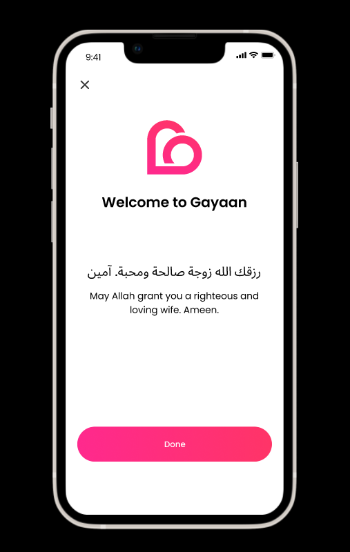

# Signup profile info

**List of signup profile informaton to be filled**
1.	Full Name
2.	Gender
3.	Date of Birth
4.	Marital Status
5.	Education
6.	Profession
7.	Brief Bio
8.	Photo

## User profile madatory information

After the singup, the process of filling signup user profiles starts as follows;

<details>
  <summary><b>Step 1: </b>Whats your full name?
</summary>

```
 Whats your full name?
```

  
</details>
<details>
  <summary><b>Step 2: </b>What's you gender?
</summary>

```
What's you gender?
```

`Male`  
`Female`


</details>

<details>
  <summary><b>Step 3: </b>Your date of birth?
</summary>

```
Your date of birth?
```

  
</details>

<details>
  <summary><b>Step 4: </b>What is your marital status?
</summary>


```
What is your marital status?
```

`Single`
`Married`

</details>

<details>
  <summary><b>Step 5: </b>What's your education level?
</summary>

```
What's your education level?
```

`Quranic school`  `primary ` `Secondary` `College` `Undergraduate` `Master's Degree` 
`Doctoral Degree (Ph.D.)`

  
</details>


<details>
  <summary><b>Step 6: </b>What is you profession?

</summary>

```
What is your profession?
```

`Doctor`    `Teacher`      `Lawyer`    `Engineer`    `Nurse`   `IT`
`Accountant`   `Police Officer`  `Chef`   `Manager` `Entrepreneur`  `Pilot`   `Electrician`  `SocialWorker` `Journalist` `Driver` `Other`

</details>


<details>
<summary><b>Step 7: </b>Your brief bio? (optional)
</summary>

```
Your brief bio? (optional)
```
</details>

<details>
<summary><b>Step 8: </b>Your photos?

</summary>


 ```
 Your photos?
```
:::note

Not all photos are uploaded; a photo should include a visible face structure, and if girls are wearing a hijab, it's acceptable as long as their eyes and other facial features are still visible. I need the app to detect face structure.

:::  

:::tip

Certainly, you can use Google's ML Kit for Firebase, which is a suite of machine learning tools provided by Google for mobile and web app development. ML Kit offers a ready-made face detection feature that can be used to detect faces in photos, including cases where individuals are wearing head coverings like hijabs

:::


</details>

<details>
<summary><b>Wellcome Page </b>

</summary>

  

:::note

The Arabic text and its translation change according to the user's gender

```text  title="Male"
رزقك الله زوجة صالحة ومحبة. آمين

May Allah grant you a righteous and loving wife. Ameen.
```

```text  title="Female"
رزقك الله زوجاً صالحاً ومحباً. آمين

May Allah grant you a righteous and loving husband. Ameen.
```
 
:::
</details>

:::note

Some screens are not included in the Figma design, but their design is the same as their similar related screens, so copy from them

:::


