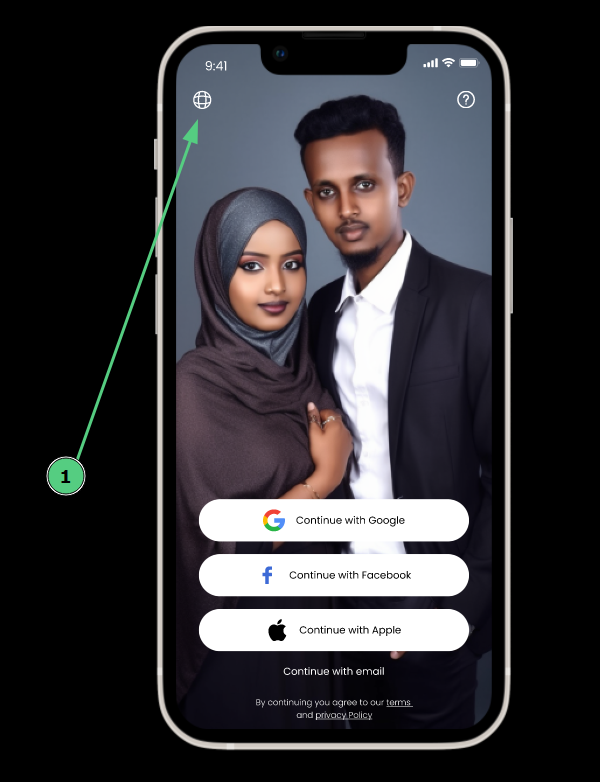

# App startup

### The App startup process

  
<b>Step 1:</b> After an app is launched, a splash screen appears.

  

  
<b>Step 2: </b>The app should prompt users for permission to access the location, camera, and microphone 

  

  
<b>Step 3:</b> A login screen appears after a short while, followed by a language switcher pop-up screen after five seconds.

  

### Popup screens on login page

  
<b>Left icon🌐 :</b> Language swithcher button

  
  

  
<b> Right icon Ⓘ :</b> Help button

  
  

