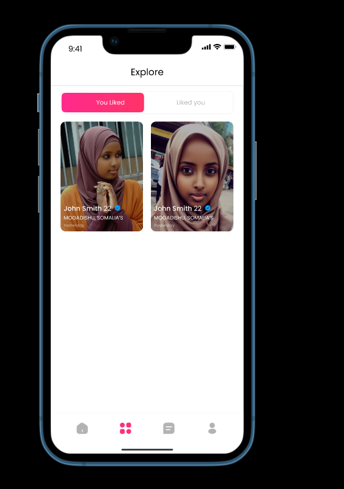
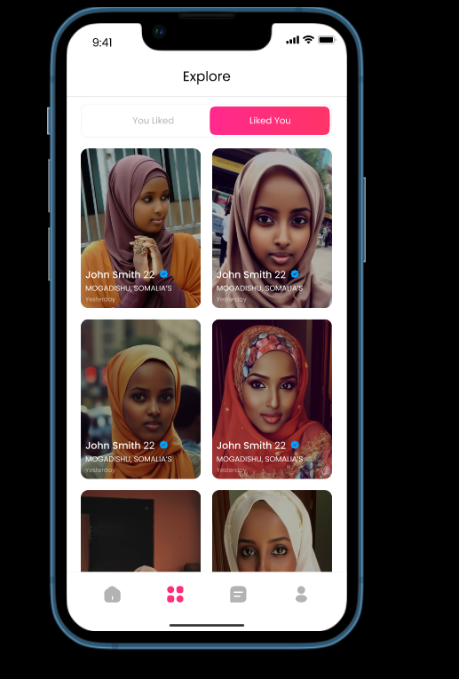

# Explore screen

The "Explore Page" in the Gayaan  provide users with different tabs to organize and manage their interactions with other users. 

Let me explain the functionality of each of these tabs:

**You Like Tab:**

- This tab stores a list of profiles of people that you, as a user, have liked

 

 You liked 

**Liked You Tab:**

The "Liked You" tab stores profiles of users who have expressed interest in you by liking your profile.

 

Liked You

**Dismissed Tab:**

- The "Dismissed" tab stores profiles of users whom you have dismissed or closed.
- When you come across a profile that doesn't match your interests, you can dismiss it, and that profile will be moved to this tab.

- Profiles in the "Dismissed" tab are typically stored temporarily for 15 days before being permanently removed.

- This tab can serve as a record of profiles you have chosen not to pursue, and it allows you to revisit and reconsider these profiles if you wish to do so.

:::note
 The dismissed tab is missing from the design, it should included in the app.
:::

