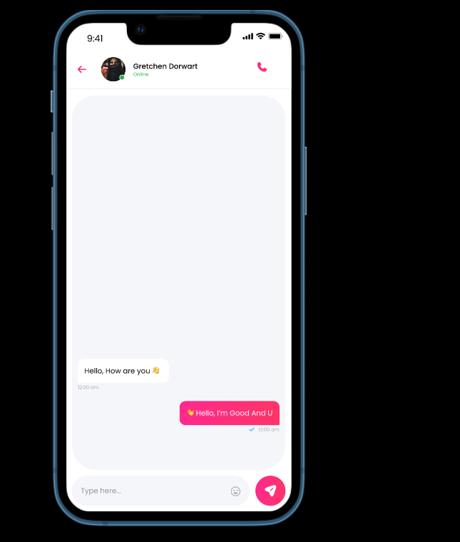

# Messaging and communication

## Methods of communition
1. Text Messaging including emoji
2. Realtime audio call

 Message screen

 

## Important features of text messaging
1. Showing Typing
2. Gray double tick (✓✓) for unseen message
3. Blue double tick  (✓✓)  for seen message
4. emoji is included

## Audio Call

My initial focus is to provide reliable and efficient communication through messaging and audio calls. I have chosen to prioritize audio calls as my first communication feature to ensure a seamless and high-quality calling experience for users.

:::tip How to impelement Audio call in our app

In my suggestion, implement audio calls by using open-source WebRTC technology by setting up a separate signaling server for WebRTC and then integrating it into the app.

 Here's how this process would typically work:

**WebRTC Integration:**

You would integrate the WebRTC technology into your app. WebRTC is a free and open-source project that provides real-time communication capabilities directly in web browsers and mobile applications.

**Signaling Server Setup:**

To facilitate the establishment of audio calls and other real-time communication, you would set up a separate signaling server. The signaling server is responsible for coordinating the communication between users, including session initiation, negotiation, and signaling.

**Integration with our App:**

The app would be configured to interact with both the WebRTC library and the signaling server.
When a user initiates an audio call, our app would use the signaling server to exchange necessary information (e.g., session description, ICE candidates) with the recipient's device.

**Peer-to-Peer Communication:**

WebRTC enables peer-to-peer communication, allowing audio data to flow directly between the calling parties without passing through a central server. This helps ensure low-latency and high-quality audio calls.

**Audio Call Features:**

You can implement various audio call features within our app, such as mute, speakerphone, and call termination, leveraging the capabilities provided by the WebRTC library.

**Security and Privacy:**

Ensure that your implementation includes security measures to protect the privacy of user data and communication. WebRTC itself offers encryption for data in transit.

**Testing and Quality Assurance:**

Thoroughly test the audio call functionality to ensure it works reliably across different devices and network conditions.
:::

