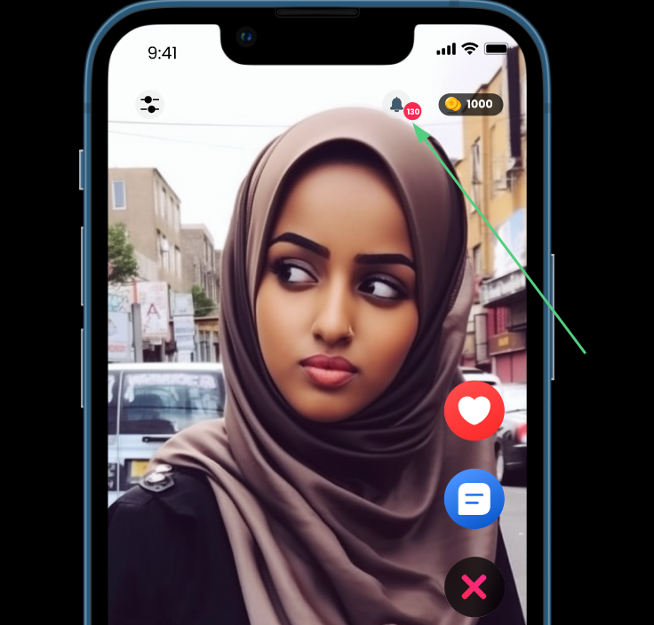
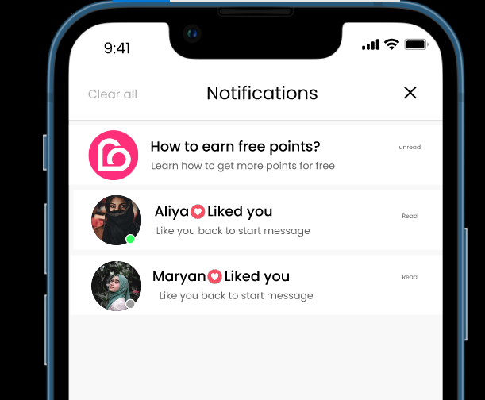

# Notification

 Notification Screens

 
 
 

## Push Notifications 

*External Notifications, recieved notification even when App is not open:*

1. **New Message:** Notify users when they receive a new message from another user.
2. **New Match:** Inform users about new mutual likes or matches, encouraging them to return to the app.
3. **App Updates:** Notify users about important app updates, new features, or bug fixes.
4. **Subscription Renewal:** Remind users about upcoming subscription renewals or notify them of successful renewals.

## In-App Notifications
*Internal Notifications, within the App:*

1. **New Message:** Show a notification within the app when users receive a new message while they are actively using it.

2. **New Match:** Display a visual notification within the app when users get new mutual likes or matches.

3. **Activity Updates:** Notify users about profile activity, such as profile views or likes, directly within the app.

4. **Reminders:** Provide in-app reminders for actions like completing the profile, sending messages, or attending events.

5. **Engagement Prompts:** Prompt users to engage with the app by suggesting actions like checking new matches or updating their profile.

